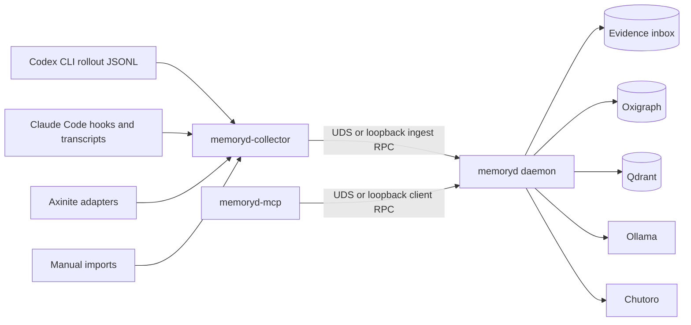
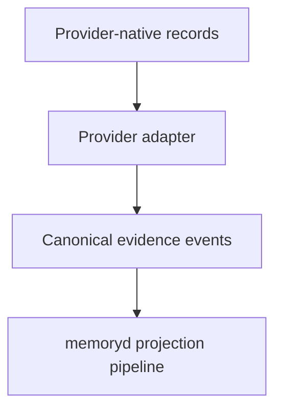
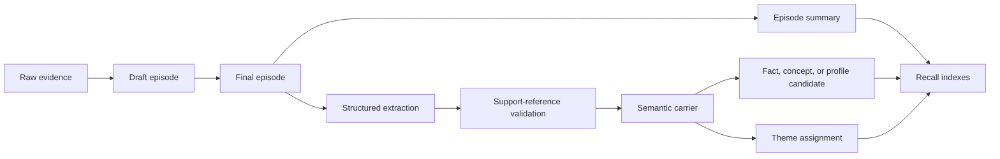

# Memoryd design

- **Status:** Draft v0.1.
- **Scope:** Standalone local `memoryd` daemon, collector sidecar, MCP front
  end, provider adapters, evidence model, projection pipeline, recall path, and
  storage boundaries.
- **Audience:** Implementers, design reviewers, Axinite integrators, and
  operators running local coding-agent memory infrastructure.
- **Companion documents:** `docs/terms-of-reference.md`,
  `docs/rfcs/0001-standalone-evidence-inbox.md`,
  `docs/rfcs/0002-projection-tiers-and-promotion-rules.md`,
  `docs/rfcs/0003-hierarchical-materialization.md`,
  `docs/rfcs/0004-theme-detection-and-rebalancing.md`,
  `docs/rfcs/0005-hierarchical-recall.md`,
  `docs/adr-001-qdrant-is-a-serving-index.md`,
  `docs/adr-002-dual-path-semantic-extraction.md`, and
  `docs/adr-003-memoryd-owns-theme-management.md`.
- **Last substantive revision:** 2026-05-25.

## 1. Problem statement

`memoryd` turns coding-agent session history into durable, local,
evidence-backed memory. Codex CLI, Claude Code, Axinite, and manual imports all
produce useful records, but their native formats are tool-specific and mix
human assertions, assistant guesses, tool calls, tool output, file edits,
errors, and compaction summaries. A standalone service must preserve those
records as evidence, derive memory artefacts with explicit provenance, and
serve bounded recall context without making Qdrant or model output the source
of truth.

The design imports the Axinite `memoryd` RFC set, then changes the ingestion
boundary. Axinite’s original design consumes a transactional PostgreSQL outbox
written inside IronClaw’s persistence transactions.[^1] Standalone `memoryd`
cannot assume external tools share that database. It replaces the single
Axinite outbox with a local evidence inbox fed by provider adapters, while
retaining Axinite’s projection taxonomy, provenance rules, Qdrant/Oxigraph
split, Chutoro theme boundary, and hierarchical recall model.[^2][^3][^4][^5]

## 2. Design goals and non-goals

### 2.1 Goals

- Ingest Codex CLI rollout logs, Claude Code hook and transcript data, Axinite
  conversations, Axinite workspace documents, and manual imports through
  provider adapters.
- Normalize provider records into a canonical evidence model before projection.
- Preserve evidence references from every retrievable semantic artefact back to
  source sessions, ordinals, byte ranges, hashes, and provider metadata.
- Keep Qdrant as a serving index, Oxigraph as graph-shaped provenance and fact
  authority, and the evidence store as raw-event authority.
- Use Ollama for local embeddings, summarization, structured extraction, and
  optional judge-model recall gating.
- Use Chutoro for clustering proposals over accepted semantic carriers while
  keeping durable theme identity inside `memoryd`.
- Expose an MCP front end shaped like Dear Diary’s ergonomic server, but route
  every operation through `memoryd` instead of exposing Qdrant directly.[^6]
- Keep Axinite usable as a first-class provider and optional projection sink.

### 2.2 Non-goals

- `memoryd` does not generate final answers. It returns context packs and
  provenance for clients to use.
- `memoryd` does not write into Codex CLI or Claude Code transcript files.
- `memoryd` does not inject memory ambiently into every agent session by
  default.
- `memoryd` does not expose arbitrary file reads through MCP.
- `memoryd` does not make Chutoro cluster labels durable theme IDs.
- `memoryd` does not attempt hosted, organization-wide analytics in this
  design.

## 3. Research summary

| Source                     | Finding                                                                                                                                                        | Design consequence                                                                                                            |
| -------------------------- | -------------------------------------------------------------------------------------------------------------------------------------------------------------- | ----------------------------------------------------------------------------------------------------------------------------- |
| Axinite RFC 0007           | The original sidecar uses local Rust, UDS RPC, capability scopes, Ollama, Qdrant, Oxigraph, and a transactional outbox.                                        | Preserve the processing and trust model, but replace the producer boundary with provider adapters and a local evidence inbox. |
| Axinite RFC 0014           | Trustworthy recall needs projection classes, epistemic status, observer/subject scope, promotion, contradiction handling, and reconciliation metadata.         | Keep these semantics as the standalone memory contract.                                                                       |
| Axinite RFC 0015           | Raw evidence, episodes, semantic carriers, and themes are separate hierarchy levels; themes are not truth claims.                                              | Build an additive projection pipeline with support-reference validation before recall.                                        |
| Axinite RFCs 0016 and 0017 | Chutoro-backed themes and hierarchical recall improve navigation only if provenance and projection classes remain visible.                                     | Add theme management and recall profiles after evidence capture and flat recall work.                                         |
| Axinite ADRs 003-005       | Theme identity belongs in `memoryd`; semantic extraction needs dual paths; recall expansion needs proxy and optional model-assisted gating.                    | Import these decisions as standalone ADRs with provider-adapter wording.                                                      |
| Dear Diary                 | A small Rust MCP server can expose simple store, find, and deprecate tools over Qdrant with read-only gates.                                                   | Reuse the ergonomic MCP shape, but replace direct Qdrant operations with `memoryd` RPC calls.                                 |
| Chutoro                    | Chutoro implements FISHDBC with HNSW, arbitrary `DataSource` metrics, sessions, and snapshots.                                                                 | Use Chutoro as a cluster proposal engine over semantic-carrier vectors, not as memory policy.                                 |
| Claude Code hooks          | Hooks provide lifecycle events, command hooks receive JSON on standard input, async hooks cannot block, and command hooks run with the user's permissions.[^7] | Treat hooks as wake-up signals and source metadata, not as trusted long-running ingestion workers.                            |
| MCP specification          | MCP uses JSON-RPC 2.0, server tools/resources/prompts, capability negotiation, and explicit security guidance around consent and data access.[^8]              | Keep MCP tools narrow, read-only mode explicit, and write or purge operations capability-gated.                               |

_Table 1: Research findings that shape the standalone design._

## 4. Terminology

| Term                | Definition                                                                                                                                |
| ------------------- | ----------------------------------------------------------------------------------------------------------------------------------------- |
| Provider adapter    | Component that converts one producer’s native records into canonical `memoryd` evidence events.                                           |
| Evidence inbox      | Durable local store for source sessions, cursors, raw events, raw spans, ingest jobs, projection sync state, and audit history.           |
| Evidence event      | Canonical record of an observed provider event, such as a user message, assistant message, tool call, compaction, approval, or file edit. |
| Evidence reference  | Stable pointer to source path, line or byte range, provider session, event ordinal, and content hash.                                     |
| Episode             | Bounded chronological memory unit materialized from raw evidence.                                                                         |
| Semantic carrier    | Validated statement distilled from one or more episodes or document spans and used to support facts, concepts, profiles, or themes.       |
| Projection          | Derived artefact or serving record written from evidence, such as an episode summary, fact, graph edge, Qdrant payload, or theme.         |
| Theme               | Durable navigation grouping over accepted semantic carriers. A theme is not evidence and is not a fact.                                   |
| Recall context pack | Bounded response containing context blocks, projection classes, epistemic status, confidence, evidence references, and selection trace.   |

_Table 2: Normative terminology._

## 5. System architecture

Standalone `memoryd` uses a provider-adapter pipeline. Producers remain
external. The collector and provider adapters read configured sources and send
canonical evidence to the daemon. The daemon owns evidence persistence,
projection, graph state, serving indexes, themes, and recall. The MCP server is
a front end over daemon RPC.



_Figure 1: Standalone `memoryd` process and storage topology._

### 5.1 Process boundaries

`memoryd-collector` owns provider discovery, file cursors, hook handling, and
redaction before ingest. It does not project memory and does not talk to
Qdrant, Oxigraph, Ollama, or Chutoro.

`memoryd` owns durable evidence storage, jobs, projection, reconciliation,
security policy, Qdrant updates, Oxigraph graph writes, Ollama calls, Chutoro
theme operations, and recall.

`memoryd-mcp` exposes MCP tools to clients. It stays thin: it validates MCP
requests, applies read-only mode, requests a scoped daemon token, calls the
daemon, and formats tool responses.

### 5.2 Trust boundaries

Provider logs, hook payloads, transcript text, tool outputs, and manual imports
are untrusted input. The collector redacts and hashes before sending evidence
to the daemon. The daemon validates every support reference emitted by a model
or extractor before a semantic carrier becomes retrievable.

MCP clients are untrusted callers with scoped capabilities. Read-only mode
permits recall, explanation, session listing, and health. It disables curated
writes, imports, retractions, profile updates, and purge.

Qdrant, Ollama, and Oxigraph are local dependencies. Qdrant and Ollama may use
loopback network ports, but Oxigraph remains embedded and private. The daemon
is the only component allowed to write serving indexes, graph state, or
projection state.

## 6. Provider adapters

Provider adapters sit above native storage and below semantic projection. They
must not leak provider-specific event shapes into the core pipeline.



_Figure 2: Adapter boundary between provider records and memory projection._

| Adapter                      | Source records                                                                      | Boundary rule                                                                                                                     |
| ---------------------------- | ----------------------------------------------------------------------------------- | --------------------------------------------------------------------------------------------------------------------------------- |
| Codex rollout adapter        | `CODEX_HOME` rollout JSONL and archived rollout JSONL                               | Tail configured roots, persist byte offsets, and key idempotency by path, line, and line hash.                                    |
| Claude Code adapter          | Hook JSON, transcript paths, compaction events, and transcript lines                | Treat command hooks as wake-up signals; tail transcripts asynchronously; never run long projection work inside hooks.             |
| Axinite conversation adapter | Conversations, messages, workspace documents, outbox events, and metadata           | Map Axinite conversations to source sessions and messages to evidence events without pretending they are Codex or Claude records. |
| Axinite projection sink      | Optional curated/profile/fact projection writes back to Axinite workspace documents | Require policy gating and provenance metadata to prevent self-reinforcing write-back loops.                                       |
| Manual import adapter        | Operator-supplied transcript or rollout paths                                       | Read only explicitly supplied files under configured roots and record import actor and request ID.                                |

_Table 3: Provider adapters and their source boundaries._

## 7. Canonical evidence model

The evidence inbox replaces Axinite’s single transactional outbox. It preserves
the same reliability intent: deduplicate inputs, retain source ordering, record
processing state, and expose replay and audit data.

The authoritative relational tables are:

```sql
CREATE TABLE source_session (
  id TEXT PRIMARY KEY,
  provider TEXT NOT NULL,
  provider_session_id TEXT NOT NULL,
  workspace_id TEXT NOT NULL,
  cwd TEXT,
  repo_origin TEXT,
  git_branch TEXT,
  git_sha TEXT,
  model TEXT,
  cli_version TEXT,
  started_at TEXT,
  ended_at TEXT,
  transcript_uri TEXT,
  parent_session_id TEXT,
  source_kind TEXT NOT NULL
);

CREATE TABLE source_cursor (
  provider TEXT NOT NULL,
  path TEXT NOT NULL,
  device TEXT,
  inode TEXT,
  last_offset INTEGER NOT NULL,
  last_line_no INTEGER NOT NULL,
  last_seen_mtime TEXT,
  file_fingerprint TEXT,
  status TEXT NOT NULL,
  updated_at TEXT NOT NULL,
  PRIMARY KEY (provider, path)
);

CREATE TABLE raw_event (
  event_id TEXT PRIMARY KEY,
  source_session_id TEXT NOT NULL,
  provider_event_id TEXT,
  ordinal INTEGER NOT NULL,
  observed_at TEXT NOT NULL,
  kind TEXT NOT NULL,
  actor TEXT NOT NULL,
  payload_redacted_json TEXT NOT NULL,
  payload_hash TEXT NOT NULL,
  source_offset_start INTEGER,
  source_offset_end INTEGER
);

CREATE TABLE raw_span (
  span_id TEXT PRIMARY KEY,
  event_id TEXT NOT NULL,
  role TEXT NOT NULL,
  text_redacted TEXT,
  content_hash TEXT NOT NULL,
  start_char INTEGER,
  end_char INTEGER,
  tool_name TEXT,
  tool_call_id TEXT
);

CREATE TABLE ingest_job (
  job_id TEXT PRIMARY KEY,
  kind TEXT NOT NULL,
  workspace_id TEXT NOT NULL,
  status TEXT NOT NULL,
  idempotency_key TEXT NOT NULL UNIQUE,
  retry_count INTEGER NOT NULL,
  last_error TEXT,
  created_at TEXT NOT NULL,
  updated_at TEXT NOT NULL
);

CREATE TABLE projection_state (
  projection_id TEXT PRIMARY KEY,
  raw_event_id TEXT NOT NULL,
  target TEXT NOT NULL,
  status TEXT NOT NULL,
  retry_count INTEGER NOT NULL,
  last_error TEXT,
  last_synced_at TEXT,
  deleted_soft INTEGER NOT NULL,
  deleted_hard INTEGER NOT NULL
);
```

_Listing 1: Evidence inbox schema outline. The implementation may use SQLite,
libSQL, or PostgreSQL, but these entities are the logical contract._

Idempotency keys are provider-specific:

- Codex: `codex:{rollout_path}:{line_no}:{line_hash}`.
- Claude transcript: `claude:{transcript_path}:{line_no}:{line_hash}`.
- Claude hook-only event:
  `claude-hook:{session_id}:{hook_event}:{monotonic_or_hash}`.
- Axinite outbox: `axinite:{outbox_id}:{event_id}`.
- MCP/manual write: `mcp:{client_id}:{request_id}`.

## 8. Projection and storage model

The daemon projects evidence through the same hierarchy imported from Axinite:



_Figure 3: Projection pipeline from evidence to recall-serving artefacts._

### 8.1 Source-of-truth boundaries

| Store               | Authority                                                                                                         | Not authoritative for                                                    |
| ------------------- | ----------------------------------------------------------------------------------------------------------------- | ------------------------------------------------------------------------ |
| Evidence inbox      | Source sessions, cursors, raw events, spans, jobs, projection sync state, and audit history                       | Graph relationships, vector ranking, or durable theme identity by itself |
| Oxigraph            | Facts, concepts, provenance edges, contradiction records, retractions, theme lineage, and temporal edges          | Raw transcript storage or vector ranking                                 |
| Qdrant              | Vector indexes and denormalized serving payloads for episodes, summaries, semantic carriers, themes, and profiles | Truth, provenance, or retraction authority                               |
| Chutoro checkpoints | Rebuildable clustering acceleration state                                                                         | Durable memory identity or theme membership authority                    |

_Table 4: Store authority boundaries._

### 8.2 Projection classes and epistemic status

The standalone service keeps Axinite’s projection classes: `episode`, `summary`,
 `concept`, `fact`, and `profile`. Claim-bearing artefacts carry one of
`explicit`, `curated`, `deduced`, `hypothesized`, or `retracted`. Episodes and
summaries remain evidence or summaries of evidence rather than facts.

The extractor defaults model-derived claims to `hypothesized`. It uses
`explicit` for direct human statements and `curated` for operator-approved MCP
writes or trusted document material. Contradiction handling follows RFC 0002:
explicit evidence retracts weaker conflicting hypotheses automatically, while
conflicts between explicit or curated claims require operator resolution.

### 8.3 Extraction

`memoryd` supports two extractors behind a shared schema:

- `encoder_extractive`: cheaper path that emits extractive spans, support
  references, confidence, and temporal hints without a generative model.
- `llm_structured`: Ollama-backed structured extraction that emits canonical
  statements, entities, relations, confidence, temporal hints, and evidence
  spans.

Both paths must pass the same support-reference validator. Unsupported semantic
carriers remain diagnostics and never enter Qdrant, Oxigraph, or theme
management.

### 8.4 Qdrant layout

Qdrant uses collection-per-workspace by default to simplify purge and reduce
filter-isolation risk. A shared-collection strategy remains a future
operational mode only if it carries equivalent filter enforcement and deletion
tests.

Default collections:

- `memoryd_{workspace}_episodes`
- `memoryd_{workspace}_summaries`
- `memoryd_{workspace}_semantic_carriers`
- `memoryd_{workspace}_themes`
- `memoryd_{workspace}_profiles`

Payloads must include projection class, epistemic status, workspace ID,
provider, source session, repository origin, observed and valid time,
confidence, retraction state, support count, evidence references, and optional
theme ID.

## 9. Theme management

The `ThemeManager` is a workspace-local daemon service. It feeds accepted
semantic-carrier vectors into Chutoro, maps Chutoro point indices back to
semantic-carrier IDs, and maps cluster proposals into durable theme records.

Chutoro remains a cluster proposal engine. `memoryd` owns:

- stable theme IDs;
- lineage for attach, split, merge, retraction, and rebuild;
- workspace purge and security boundaries;
- curated-memory precedence;
- theme summaries and refresh jobs;
- retrieval-aware split and merge policy.

The default policy starts in shadow mode:

| Setting                   | Default | Purpose                                                    |
| ------------------------- | ------- | ---------------------------------------------------------- |
| `bootstrap_min_semantics` | `24`    | First point where workspace clustering becomes meaningful. |
| `max_semantics_per_theme` | `12`    | Upper bound before split evaluation.                       |
| `min_semantics_per_theme` | `3`     | Lower bound before merge or singleton handling.            |
| `theme_knn_k`             | `10`    | Neighbour graph width for routing and merge evaluation.    |
| `split_cooldown`          | `1h`    | Prevents repeated churn in the same dense region.          |
| `merge_cooldown`          | `1h`    | Prevents repeated merge oscillation.                       |

_Table 5: Initial theme-management policy._

## 10. Recall

Recall embeds the query once, gathers projection-aware candidates, selects a
compact high-level skeleton, and expands to episodes or raw-message blocks only
when the gain justifies the token cost.

Required recall profiles:

| Profile           | Behaviour                                                                                    |
| ----------------- | -------------------------------------------------------------------------------------------- |
| `flat_v1`         | Vector and graph retrieval without theme expansion.                                          |
| `cheap_v2`        | Hierarchical recall with deterministic proxy gating and no raw-message expansion by default. |
| `hierarchical_v2` | Default top-down theme, semantic-carrier, and episode retrieval.                             |
| `evidence_v2`     | Hierarchical recall with optional model-assisted expansion gating.                           |

_Table 6: Recall profiles._

The daemon returns context blocks, selected theme IDs, selected semantic IDs,
selected episode IDs, provenance references, fallback reasons, and a selection
trace. It never returns an unbounded transcript dump.

## 11. MCP front end

The MCP server follows Dear Diary’s practical structure: typed request objects,
tool routing, read-only gates, and a small operator-facing tool set. The
semantics differ: tools call `memoryd`, not Qdrant.

| Tool                    | Mode       | Purpose                                                                   |
| ----------------------- | ---------- | ------------------------------------------------------------------------- |
| `memory_store`          | Write      | Store curated or explicit memory through the daemon.                      |
| `memory_recall`         | Read       | Retrieve a bounded context pack.                                          |
| `memory_explain`        | Read       | Explain why a memory exists or why recall selected it.                    |
| `memory_retract`        | Write      | Retract a memory, fact, episode, theme, or source session.                |
| `memory_sessions`       | Read       | Browse ingested sessions by provider, workspace, model, branch, and time. |
| `memory_import_session` | Write      | Import an explicit transcript or rollout file.                            |
| `memory_profile`        | Read/write | Read or update stable profile material.                                   |
| `memory_health`         | Read       | Report daemon, dependency, collector, and theme state.                    |

_Table 7: MCP tool surface._

Read-only mode disables `memory_store`, `memory_retract`,
`memory_import_session`, and profile updates. The daemon also enforces
capability scopes, so read-only mode is a convenience gate rather than the only
authorization layer.

## 12. Internal RPC

Collector and MCP components call the daemon over Unix domain socket by
default. HTTP loopback is a debug or container mode and requires bearer or
capability tokens.

Internal methods:

- `IngestSourceEvent`
- `IngestTranscriptLine`
- `FinalizeSession`
- `Recall`
- `ReadFacts`
- `ReadEpisode`
- `ReadTheme`
- `StoreCuratedMemory`
- `Retract`
- `Reinforce`
- `ScheduleConsolidation`
- `ImportTranscript`
- `ListSessions`
- `Health`
- `PurgeWorkspace`

Capability scopes:

- `memory.ingest`
- `memory.recall`
- `memory.read`
- `memory.write_curated`
- `memory.retract`
- `memory.reinforce`
- `memory.consolidate`
- `memory.admin`
- `memory.purge`

Collector tokens receive only `memory.ingest`. MCP clients receive read/write
scopes based on configuration. `PurgeWorkspace` requires both a high-privilege
token and an explicit confirmation string.

## 13. Security and privacy

The collector redacts before storage and before embedding. The first release
must detect API keys, OAuth tokens, JSON Web Tokens (JWTs), private keys, SSH
material, `.env` content, passwords, cookies, cloud credentials, database URLs,
and high-entropy blobs. Per-workspace deny patterns block configured paths from
transcript capture and import.

Large tool outputs are not embedded directly. The daemon summarizes or extracts
bounded spans, records hashes and evidence references, and keeps raw references
available for explicit explanation or operator inspection.

Claude Code command hooks require special care because they run with the user’s
permissions.[^7] `memoryd` hook installation must call a narrow
`memoryd-collector hook --provider claude-code` command rather than arbitrary
shell pipelines.

## 14. Configuration

The configuration file is TOML. This shape is normative for field names even if
the implementation later splits sections by crate.

```toml
[daemon]
data_dir = "~/.local/share/memoryd"
uds_path = "~/.local/share/memoryd/memoryd.sock"
mode = "shadow" # disabled | observe | project_shadow | recall_shadow | active

[store]
driver = "sqlite"
sqlite_path = "~/.local/share/memoryd/memoryd.sqlite3"

[qdrant]
url = "http://127.0.0.1:6334"
api_key_env = "QDRANT_API_KEY"
collection_prefix = "memoryd"
collection_strategy = "per_workspace"

[ollama]
base_url = "http://127.0.0.1:11434"
embedding_model = "nomic-embed-text"
extraction_model = "qwen2.5:7b-instruct"
judge_model = "qwen2.5:7b-instruct"
strict_local = true

[graph]
driver = "oxigraph"
path = "~/.local/share/memoryd/graph"

[chutoro]
bootstrap_min_semantics = 24
max_semantics_per_theme = 12
min_semantics_per_theme = 3
theme_knn_k = 10
split_shadow = true
merge_shadow = true

[providers.codex]
enabled = true
codex_home_env = "CODEX_HOME"
default_codex_home = "~/.codex"
watch_globs = [
  "{codex_home}/sessions/**/*.jsonl",
  "{codex_home}/archived_sessions/**/*.jsonl",
]

[providers.claude_code]
enabled = true
hook_mode = "command"
watch_transcripts = true
install_scope = "user"

[privacy]
redact_before_store = true
redact_before_embedding = true
store_raw_text = "redacted" # none | redacted | encrypted
```

_Listing 2: Initial configuration shape._

## 15. Verification strategy

The design carries three correctness surfaces that deserve explicit
verification beyond ordinary unit and behavioural tests.

| Property                     | Verification method                                                                                      | Scope                                                                         |
| ---------------------------- | -------------------------------------------------------------------------------------------------------- | ----------------------------------------------------------------------------- |
| Ingestion idempotency        | Property tests over provider paths, offsets, line hashes, hook retries, and import request IDs           | `source_cursor`, `raw_event`, `raw_span`, and `ingest_job` writes             |
| Projection provenance        | Property tests and fixture-based replay that reject semantic carriers with unresolved support references | Extractor outputs, validator, Qdrant writes, and Oxigraph writes              |
| Workspace purge completeness | End-to-end fixture that creates evidence, graph edges, Qdrant payloads, Chutoro checkpoints, then purges | Evidence inbox, Oxigraph namespaces, Qdrant collections, and checkpoint files |

_Table 8: Design-level verification targets._

The integration surface is combinatorial: provider (`codex`, `claude_code`,
`axinite`, `manual`) × daemon mode (`observe`, `project_shadow`,
`recall_shadow`, `active`) × recall profile (`flat_v1`, `cheap_v2`,
`hierarchical_v2`, `evidence_v2`) × read-only mode. The minimum coverage set
must include each provider in `observe`, one provider in full active recall,
read-only MCP denial of each write tool, and one purge path with projected
Qdrant, Oxigraph, and Chutoro artefacts.

## 16. Rollout sequence

1. **Evidence capture.** Implement provider discovery, cursor persistence,
   redaction, raw event normalization, session listing, and health checks.
2. **Dear Diary parity through the daemon.** Add curated writes, flat recall,
   retraction, Qdrant indexing, and audit records without exposing collection
   names through MCP.
3. **Episodes and semantic projection.** Add episode finalization, summaries,
   embeddings, structured extraction, and support-reference validation.
4. **Facts, profiles, and graph promotion.** Add Oxigraph facts,
   contradictions, profile promotion, and curated write precedence.
5. **Themes and hierarchical recall.** Add Chutoro bootstrap, incremental
   attach, split/merge shadowing, and recall profiles beyond `flat_v1`.
6. **Axinite write-back.** Add optional projection sink support only after
   loop-prevention metadata and approval policy are implemented.

## 17. Open design decisions

- Choose the default evidence-store engine and migration format.
- Decide whether a graph-shaped relational fallback is allowed when Oxigraph is
  disabled.
- Define exact Axinite projection write-back policy.
- Define the redaction detector set and encrypted raw-text mode.
- Define the Chutoro checkpoint format and acceptable theme-ID churn during
  rebuild.

## References

[^1]: `../axinite/docs/rfcs/0007-secure-memory-sidecar-design.md`.
[^2]: `../axinite/docs/rfcs/0014-memory-projection-tiers-and-promotion-rules.md`.
[^3]: `../axinite/docs/rfcs/0015-hierarchical-memory-materialization-for-memoryd.md`.
[^4]: `../axinite/docs/rfcs/0016-theme-detection-and-sparsity-rebalancing-for-memoryd.md`.
[^5]: `../axinite/docs/rfcs/0017-hierarchical-recall-for-memoryd.md`.
[^6]: `../dear-diary/README.md` and
    `../dear-diary/crates/dear-diary-mcp/src/server.rs`.
[^7]: Claude Code hooks reference, accessed 2026-05-25:
    <https://code.claude.com/docs/en/hooks>.
[^8]: Model Context Protocol latest specification, accessed 2026-05-25:
    <https://modelcontextprotocol.io/specification/latest>.
