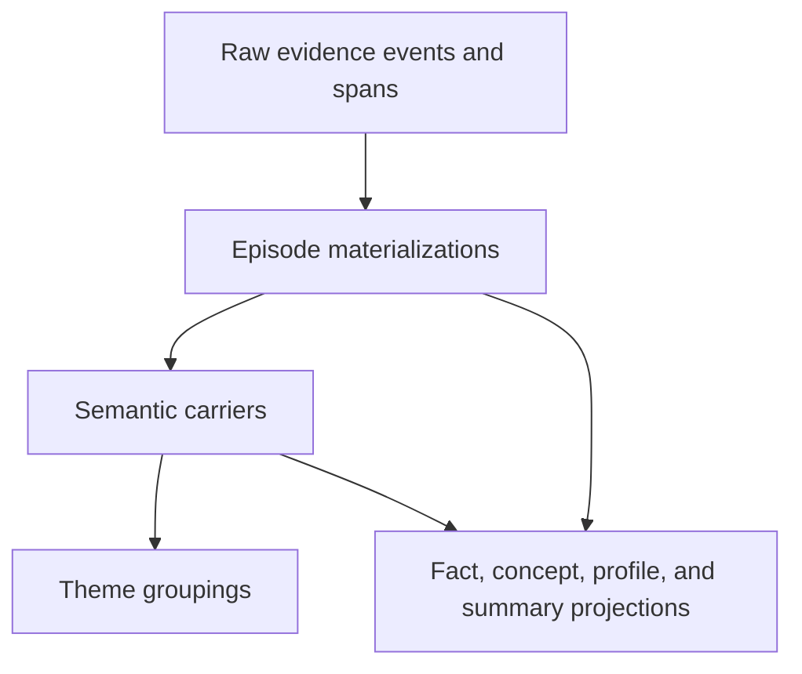

# RFC 0003: Hierarchical materialization

## Preamble

- **RFC number:** 0003
- **Status:** Proposed
- **Created:** 2026-05-25
- **Adapted from:**
  `../axinite/docs/rfcs/0015-hierarchical-memory-materialization-for-memoryd.md`
- **Related:** RFC 0002, RFC 0004, and RFC 0005.

## Summary

This RFC defines how standalone `memoryd` materializes raw evidence into
episodes, semantic carriers, and optional themes without replacing RFC 0002’s
projection taxonomy.

## Problem

The evidence inbox stores provider events. Recall needs larger units with
ordering, summaries, support references, and semantic statements. If `memoryd`
indexes raw messages directly, it inherits transcript noise. If it indexes only
model summaries, it loses evidence. The hierarchy must preserve both.

## Goals and non-goals

- Goals:
  - Define raw evidence, episode, semantic-carrier, and theme layers.
  - Define hard and soft episode boundary rules for coding-agent logs.
  - Define provenance and temporal invariants.
  - Define retraction and purge propagation through the hierarchy.
- Non-goals:
  - Redefine projection classes or epistemic status.
  - Define final recall ranking. RFC 0005 owns that.
  - Move theme identity into Chutoro.

## Proposed design

### Hierarchy

_Figure 1: Materialization hierarchy._

### Episode boundaries

Hard splits occur on:

- new provider session;
- new workspace or repository fingerprint;
- Codex compaction item or Claude `PostCompact`;
- long idle gap;
- large tool-use burst ending in a user-visible result;
- file-edit sequence followed by test or build output;
- model, agent, or subagent switch.

Soft boundaries may come from an Ollama classifier, encoder classifier, lexical
shift, or time gap. Hard splits always win.

### Semantic carriers

Semantic carriers carry:

- canonical or extractive text;
- semantic kind;
- evidence references;
- confidence;
- extraction mode;
- temporal hints;
- mapping to fact, concept, or profile candidates.

They are not retrievable until all support references validate.

### Temporal model

`memoryd` records observed time for evidence and valid time for claims.
Temporal basis is one of `explicit`, `metadata`, `inferred`, or `unknown`.
Inferred valid time remains weaker than metadata-backed or curated time.

### Retraction and purge propagation

Retraction propagates down support edges:

- retracting raw evidence retracts unsupported episodes;
- retracting episodes retracts unsupported semantic carriers;
- retracting all active semantic carriers in a theme retracts or supersedes
  the theme;
- purge removes evidence rows, graph namespaces, Qdrant serving collections,
  and Chutoro checkpoints.

## Compatibility and migration

Axinite curated workspace documents become synthetic document-revision
episodes. Codex and Claude compaction events become hard boundary markers and
summary evidence, not trusted facts by default.

## Open questions

- What idle-gap default should define an episode split?
- How much raw tool output should be retained in redacted form?
- Which file-edit and test-output patterns deserve first-class evidence kinds?

## Recommendation

Adopt the Axinite hierarchy with provider-specific hard boundary rules for
coding-agent logs. Keep semantic carriers below RFC 0002 projection classes and
above theme navigation.
