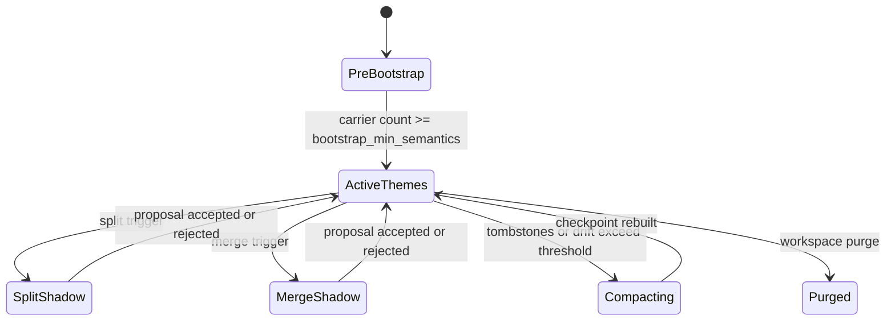

# RFC 0004: Theme detection and rebalancing

## Preamble

- **RFC number:** 0004
- **Status:** Proposed
- **Created:** 2026-05-25
- **Adapted from:**
  `../axinite/docs/rfcs/0016-theme-detection-and-sparsity-rebalancing-for-memoryd.md`
- **Depends on:** RFC 0003 and ADR 003.

## Summary

This RFC defines workspace-local theme management over accepted semantic
carriers. Chutoro supplies clustering proposals. `memoryd` owns durable theme
identity, membership, lineage, balancing, and recall-facing summaries.

## Problem

Flat semantic-carrier retrieval becomes crowded as a workspace grows.
Near-duplicate carriers dominate dense regions, while sparse topics can vanish
from top-k recall. Themes provide a higher-level navigation layer, but only if
theme identity remains stable and provenance remains attached to the underlying
semantic carriers.

## Goals and non-goals

- Goals:
  - Use Chutoro for bootstrap clustering and local split proposals.
  - Keep stable theme IDs and lineage in `memoryd`.
  - Maintain bounded, queryable theme partitions.
  - Preserve provenance, retraction state, and workspace isolation.
- Non-goals:
  - Treat themes as evidence or facts.
  - Move memory policy into `chutoro-core`.
  - Require exact decremental clustering for every retraction.

## Proposed design

### Theme manager responsibilities

`ThemeManager` owns:

- a workspace-local Chutoro session over active semantic carriers;
- durable theme records;
- membership and lineage edges;
- theme and semantic-carrier k-nearest neighbour graphs;
- attach, split, merge, summary refresh, and compaction jobs.

### Policy defaults

| Setting                   | Default |
| ------------------------- | ------- |
| `bootstrap_min_semantics` | `24`    |
| `max_semantics_per_theme` | `12`    |
| `min_semantics_per_theme` | `3`     |
| `theme_knn_k`             | `10`    |
| `split_cooldown`          | `1h`    |
| `merge_cooldown`          | `1h`    |

_Table 1: Theme defaults._

### Lifecycle

_Figure 1: Theme-manager lifecycle._

### Split and merge rules

Splits create new theme IDs and mark the source theme as superseded. Merges
preserve a dominant theme ID when one exists; otherwise they create a new
merged theme ID and supersede sources. Semantic carriers keep their own IDs
across membership changes.

## Compatibility and migration

Workspaces start in `PreBootstrap`. `flat_v1` recall remains available before
themes exist. Theme summary refresh is asynchronous and cannot promote or
retract facts by itself.

## Open questions

- What checkpoint format should persist Chutoro sessions?
- How much theme-ID churn is acceptable during full rebuilds?
- Which objective weights should ship as defaults after shadow evaluation?

## Recommendation

Adopt workspace-local theme management after semantic-carrier validation is in
place. Keep all split and merge policy in `memoryd`, and keep Chutoro snapshots
rebuildable.
