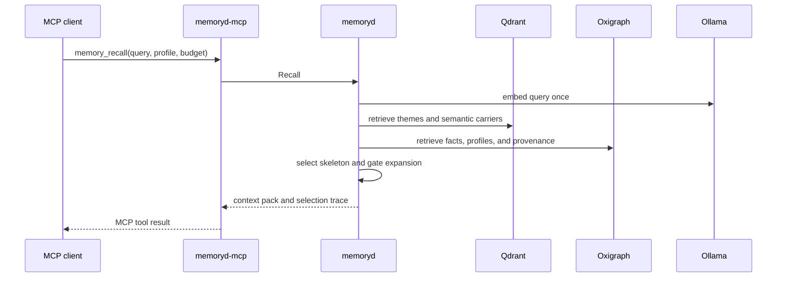

# RFC 0005: Hierarchical recall

## Preamble

- **RFC number:** 0005
- **Status:** Proposed
- **Created:** 2026-05-25
- **Adapted from:**
  `../axinite/docs/rfcs/0017-hierarchical-recall-for-memoryd.md`
- **Depends on:** RFC 0003, RFC 0004, and ADR 004.

## Summary

This RFC extends `Recall` from flat retrieval over projection artefacts into a
top-down read path over profiles, facts, themes, semantic carriers, episodes,
and optional raw-message blocks. Recall returns context packs and diagnostics,
not final answers.

## Problem

Flat nearest-neighbour retrieval loses structure. Multi-fact questions need
several connected semantics, temporal questions need evidence chains, and theme
expansion can waste tokens if it expands every candidate. `memoryd` needs a
bounded retrieval path that keeps projection class, epistemic status, and
evidence visible.

## Goals and non-goals

- Goals:
  - Define recall profiles.
  - Select a compact high-level skeleton before expanding evidence.
  - Expand only intact episodes or contiguous raw-message blocks.
  - Return provenance and selection diagnostics.
  - Persist bounded recall audit records when policy requires them.
  - Fall back to flat recall when hierarchy is unavailable.
- Non-goals:
  - Generate final answers.
  - Make model-assisted gating mandatory.
  - Replace direct fact reads.

## Proposed design

### Profiles

| Profile           | Behaviour                                                             |
| ----------------- | --------------------------------------------------------------------- |
| `flat_v1`         | Vector and graph retrieval without theme expansion.                   |
| `cheap_v2`        | Hierarchical retrieval with deterministic proxy gating.               |
| `hierarchical_v2` | Default theme, semantic-carrier, and episode retrieval.               |
| `evidence_v2`     | Hierarchical retrieval with optional model-assisted expansion gating. |

_Table 1: Recall profiles._

### Read path

_Figure 1: Hierarchical recall request flow._

### Context assembly

The daemon orders returned context blocks as:

1. curated profile traits and facts;
2. selected theme summaries;
3. selected semantic-carrier statements grouped by theme;
4. selected episodes in temporal order;
5. optional raw-message blocks nested under selected episodes.

Every block includes projection class, epistemic status where applicable,
confidence, estimated token count, and evidence references.

### Durable recall audit

Recall traces can be persisted according to `RecallAuditMode`: `none`,
`errors_only`, `decision_relevant`, `sampled`, or `all`. Durable audit records
store tenant and workspace, query hash, optional redacted query text when
policy allows it, recall profile, token budget, selected artefact IDs, top
rejected candidate IDs, filter trace, fallback reason, source-health summary,
and configuration digests.

The daemon owns audit policy. A client may request stricter audit, but cannot
disable a policy-required audit.

### Fallback behaviour

The daemon falls back to `flat_v1` when theme state is absent, stale, purged,
or disabled. The response includes `fallback_reason` so shadow evaluation can
measure hierarchy availability.

## Compatibility and migration

`memory_recall` can expose `flat_v1` before RFC 0004 themes exist. `cheap_v2`
requires semantic carriers and theme or semantic-neighbour structure.
`evidence_v2` requires a configured local judge model.

## Open questions

- Which proxy-gate weights should ship first?
- What token-budget defaults should apply by MCP client type?
- Which recall trace fields are stable enough for users to rely on?

## Recommendation

Ship `flat_v1` first, then add `cheap_v2`, then `hierarchical_v2`, and enable
`evidence_v2` only where local model capacity and latency are acceptable.
