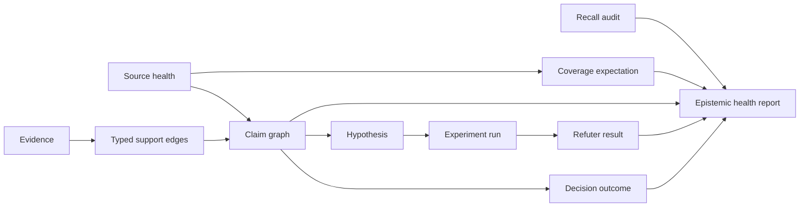

# RFC 0006: Epistemic health, empiricism, falsification, and semirings

## Preamble

- **RFC number:** 0006
- **Status:** Proposed
- **Created:** 2026-05-25
- **Depends on:** ADR 008, ADR 009, ADR 010, ADR 011, ADR 012, RFC 0002,
  RFC 0003, RFC 0004, and RFC 0005.
- **Target release:** Post-1.0.

## Summary

This RFC proposes a post-1.0 epistemic-health extension for `memoryd`. The
extension supports Axinite v1.2-style world-model experiments without moving
agentic judgement, causal inference, experiment execution, or organizational
management into `memoryd`.

The proposal adds four post-1.0 surfaces:

- claim graphs with semiring-shaped provenance expressions;
- coverage expectations and omission alerts;
- hypothesis, experiment, and falsification records;
- decision, outcome, and uptake records.

These surfaces build on pre-1.0 ADRs that add source health, stable claim
identity, typed support edges, projection activity lineage, and optional
durable recall audits.

## Problem

The v1 `memoryd` design can preserve evidence, derive semantic carriers,
validate support references, promote graph-backed facts, handle contradictions,
and return bounded recall context. That is enough for trustworthy local memory.
It is not enough for systems that must reason about the quality of knowledge
over time.

Axinite's v1.2 proposals need support for harder questions:

- What exactly supports this claim, and how do multiple supports compose?
- Which expected evidence was missing or stale when the claim was made?
- Is a surfaced relationship an observation, an association, a hypothesis, or
  a causal conclusion?
- Which hypotheses were tested, refuted, supported, or left inconclusive?
- Which recommendations were accepted, rejected, modified, ignored, or later
  contradicted by outcomes?

Those are not final-answer generation tasks. They are memory-substrate tasks.
`memoryd` should expose durable, evidence-linked records that Axinite and other
agents can use, while keeping interpretation, experimentation, and action in
the agentic layer.

## Goals and non-goals

- Goals:
  - Define post-1.0 claim graph records and semiring-shaped provenance
    expressions.
  - Define source coverage expectations, omission alerts, and epistemic health
    reports.
  - Define durable hypothesis, experiment, refuter, and falsification records.
  - Define decision, outcome, and uptake records that link recommendations to
    observed results without treating acceptance as truth.
  - Explain how these records build on ADRs 008-012.
  - Preserve tenant isolation, workspace scoping, provenance, purge, and
    hexagonal architecture boundaries.
- Non-goals:
  - Run causal experiments inside `memoryd`.
  - Decide causality from recall scores or model output.
  - Generate final answers or recommendations.
  - Model organization-wide culture, incentives, or management structure.
  - Replace Axinite's agentic layer, policy gates, delegated jobs, or execution
    ledger.
  - Require a full provenance semiring implementation before the first
    post-1.0 experiment.

## Foundation from pre-1.0 ADRs

| Pre-1.0 decision                               | What it supplies                                   | Post-1.0 use                                                                           |
| ---------------------------------------------- | -------------------------------------------------- | -------------------------------------------------------------------------------------- |
| ADR 008: Source health and coverage foundation | Tenant-scoped source registry and health snapshots | Coverage expectations, omission alerts, and source-freshness facets in claim validity. |
| ADR 009: Claim identity and interpretive kind  | Stable `ClaimId` and `ClaimKind`                   | Claim graph nodes, hypothesis inputs, causal boundaries, and decision records.         |
| ADR 010: Typed support edges                   | Validated support roles and support lifecycle      | Atoms for provenance expressions, contradiction pressure, and falsification.           |
| ADR 011: Projection activity lineage           | Derivation activity records                        | Replay, recomputation, validator audit, and activity-to-claim provenance.              |
| ADR 012: Durable recall audits                 | Optional persistent recall traces                  | Salience audits, omission analysis, and decision-relevant evidence review.             |

_Table 1: How post-1.0 epistemic health builds on pre-1.0 decisions._

## Proposed design

### Architecture

The extension keeps `memoryd` as an epistemic substrate. Agentic clients write
and read structured records; they do not delegate judgement to `memoryd`.



_Figure 1: Post-1.0 epistemic-health records._

### Claim graph

A claim graph makes claim validity inspectable and recomputable. It extends ADR
009 claim identity and ADR 010 support edges without replacing RFC 0002
projection classes.

A `ClaimGraphRecord` contains:

- `claim_id`;
- tenant and workspace;
- canonical statement;
- `claim_kind`;
- projection class;
- epistemic status;
- current validity state;
- support edge IDs;
- contradiction and refutation edge IDs;
- derivation activity IDs;
- provenance expression;
- confidence decomposition;
- freshness and source-health summary;
- recomputation timestamp and validator version.

The first validity states are:

- `supported`;
- `supported_with_gap`;
- `contested`;
- `stale`;
- `unsupported`;
- `refuted`;
- `retracted`;
- `unknown`.

Validity state is not a final answer. It describes whether the stored support
structure is still adequate under configured validation rules.

### Semiring-shaped provenance

The RFC adopts semiring-shaped provenance expressions as a post-1.0 design
target. The first implementation may store expressions without exposing a full
generic algebra.

The expression grammar is intentionally small:

```plaintext
expression = atom | expression + expression | expression * expression
atom       = support_edge_id | claim_id | activity_id
```

`+` means alternative support. `*` means conjunctive dependency. For example:

```plaintext
(support_release_log * support_metric_snapshot) + support_operator_curation
```

The same expression can be evaluated through different facets:

| Facet           | Meaning                                                                 |
| --------------- | ----------------------------------------------------------------------- |
| Boolean support | Is there at least one valid support path?                               |
| Freshness       | How stale is the weakest necessary support?                             |
| Source quality  | Does the claim depend on weak, untrusted, or disputed sources?          |
| Coverage        | Were expected source classes present when support was evaluated?        |
| Inference depth | How many model or reconciler activities sit between evidence and claim? |
| Contestation    | Does contradictory or refuting support exist?                           |

_Table 2: Initial provenance-expression facets._

This avoids a single false-precision confidence score. `memoryd` may return a
compact `effective_score` for ranking, but explanations must preserve the
components that produced it.

### Coverage expectations and omission alerts

ADR 008 source health records describe observed source state. Post-1.0 coverage
expectations describe what should have been observed for a subject, source set,
or claim class.

A `CoverageExpectation` contains:

- `coverage_id`;
- tenant and workspace;
- subject or scope;
- expected source IDs;
- expected source classes;
- expected claim classes;
- freshness service-level objectives;
- required and optional sources;
- policy for blocked or inaccessible sources;
- severity thresholds.

An `OmissionAlert` records:

- stale expected source;
- missing expected source;
- missing expected claim class;
- blocked source;
- degraded source;
- coverage drop;
- recall salience shift.

Omission alerts do not automatically retract claims. They affect validity
state, recall explanations, and epistemic-health reports.

### Hypotheses, empiricism, and falsification

`memoryd` should store hypotheses and empirical checks, not conduct open-ended
causal reasoning.

A `HypothesisRecord` contains:

- `hypothesis_id`;
- tenant and workspace;
- question;
- `hypothesis_kind`;
- input claim IDs;
- proposed mechanism;
- candidate causes;
- outcome variable;
- assumptions;
- possible confounders;
- proposed observation window;
- review status;
- promotion guardrails.

The first hypothesis lifecycle is:

```plaintext
draft -> reviewed -> testable -> running -> analysed
analysed -> supported | refuted | inconclusive | needs_more_evidence
```

An `ExperimentRunRecord` contains:

- experiment ID;
- hypothesis ID;
- method;
- design summary;
- treatment or intervention reference;
- comparison group or baseline;
- observation window;
- primary metric;
- guardrail metrics;
- assumptions;
- result summary;
- activity and evidence links.

A `RefuterResult` contains:

- refuter ID;
- experiment ID or hypothesis ID;
- refuter kind;
- result: `passed`, `failed`, `inconclusive`, or `not_applicable`;
- diagnostic evidence;
- effect on hypothesis state.

The extension should support common empirical records such as controlled
experiments, before-and-after checks, difference-in-differences summaries,
placebo tests, dummy-outcome tests, and human review results. It should not
claim that any method proves causality without the assumptions recorded beside
it.

### Decision, outcome, and uptake records

Outcome learning requires a stable link from recommendation to human decision
to observed result. This RFC adds records that Axinite can write when it
surfaces a recommendation or evaluates an outcome.

A `DecisionOutcomeRecord` contains:

- decision ID;
- recommendation ID or claim ID;
- hypothesis ID where applicable;
- actor role;
- decision state: `accepted`, `accepted_with_modification`, `rejected`,
  `deferred`, `ignored`, or `superseded`;
- rationale;
- implementation reference;
- expected outcome;
- observation window;
- observed outcome;
- learning disposition;
- uptake signals.

Uptake signals describe repeated use, stable rejection, local override, or
adoption by a workflow. They do not promote factual truth. Acceptance can be
useful personalization evidence, but it is not evidence that a claim was true.

### Epistemic health report

An `EpistemicHealthReport` is a bounded read model over claim graph, source
health, coverage, recall audit, hypothesis, and outcome records. It is intended
for operators and agentic clients.

The report can include:

- unsupported claim count;
- contested claim count;
- stale support count;
- source-health summary;
- coverage expectation status;
- omission alerts;
- recall fallback and salience drift summary;
- hypotheses by state;
- refuted or inconclusive hypotheses;
- recommendation outcome linkage rate;
- decision records with missing outcome windows.

The report is advisory. It does not generate final answers and does not make
policy decisions.

## Interfaces

The post-1.0 daemon should add internal RPC methods first. MCP exposure should
be narrower and capability-gated.

Candidate internal methods:

- `ReadClaims`;
- `ValidateClaim`;
- `RecomputeClaimValidity`;
- `RegisterCoverageExpectation`;
- `ReadCoverageReport`;
- `ReadOmissionAlerts`;
- `RecordHypothesis`;
- `UpdateHypothesisState`;
- `RecordExperimentRun`;
- `RecordRefuterResult`;
- `RecordDecisionOutcome`;
- `ReadDecisionOutcome`;
- `ReadEpistemicHealthReport`.

Candidate MCP tools:

- `memory_claims`;
- `memory_coverage`;
- `memory_hypotheses`;
- `memory_outcomes`;
- `memory_epistemic_health`.

The public MCP surface should not expose low-level semiring algebra as a
general tool in the first iteration. It should return explanations and compact
reports.

## Storage and source-of-truth boundaries

The extension keeps the existing v1 store boundaries:

- the evidence store owns source health, activity lineage, recall audit,
  coverage expectation, hypothesis, experiment, refuter, and decision-outcome
  rows;
- Oxigraph owns claim graph edges, provenance relations, contradiction,
  refutation, temporal, and derivation relationships;
- Qdrant carries denormalized serving payloads and filters;
- Chutoro remains a clustering proposal engine and does not participate in
  epistemic validity.

Every record is tenant-scoped. Purge must remove the post-1.0 records alongside
v1 evidence, graph, serving index, and checkpoint state.

## Verification strategy

The extension has four design-level invariants:

| Property                                  | Verification method                                                                                                            |
| ----------------------------------------- | ------------------------------------------------------------------------------------------------------------------------------ |
| Claim validity is replayable              | Fixture replay produces the same validity state from the same evidence, support edges, activities, and source health.          |
| Omission is visible                       | Synthetic source dropout and missing claim-class fixtures produce coverage reports and alerts.                                 |
| Causal claims cannot skip lifecycle state | Property and behavioural tests reject association-to-causal-conclusion promotion without review or empirical support.          |
| Acceptance is not truth                   | Outcome fixtures prove accepted recommendations do not promote underlying claims unless evidence or review supports promotion. |

_Table 3: Epistemic-health verification targets._

Additional evaluation should track:

- support-reference resolution rate;
- dangling support-edge count;
- stale-source detection lag;
- coverage-alert false positive rate;
- recall audit storage growth;
- claim replay determinism;
- hypothesis states with missing observation windows;
- decision records with missing outcomes.

## Compatibility and migration

The migration path is additive:

1. Use ADR 009 `ClaimId` records as initial claim graph nodes.
2. Use ADR 010 support edges as provenance-expression atoms.
3. Use ADR 011 projection activities as derivation atoms.
4. Use ADR 008 source-health snapshots as freshness and coverage facets.
5. Use ADR 012 recall audits as salience and omission evidence.
6. Backfill claim graph records from existing graph facts and semantic carriers.
7. Enable coverage expectations and hypothesis records per tenant workspace.

Existing v1 recall should continue to work when post-1.0 epistemic-health
features are disabled. The extension must not change the meaning of `explicit`,
`curated`, `deduced`, `hypothesized`, or `retracted`.

## Open questions

- Which provenance-expression facets should affect default recall ranking?
- Which claim kinds require coverage expectations before promotion?
- Should claim validity recomputation run eagerly after source-health changes
  or lazily when a claim is read?
- Which empirical methods deserve first-class records beyond generic
  experiment metadata?
- How should operators tune omission-alert severity without creating alert
  fatigue?
- Which post-1.0 MCP tools are safe for general local clients rather than
  Axinite-only or admin-only use?

## Recommendation

Adopt this RFC as the post-1.0 direction for Axinite v1.2 support. Keep v1
focused on trustworthy evidence-backed memory, but implement ADRs 008-012
before v1 so the post-1.0 epistemic-health layer can be additive rather than a
schema rewrite.
